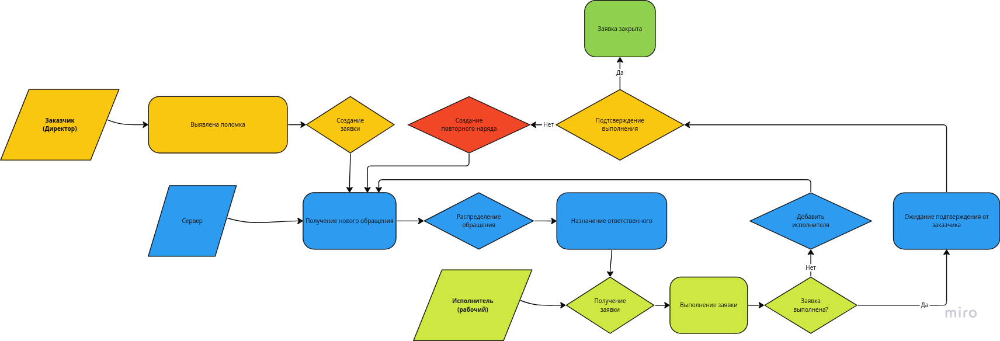

# SRM-service 
# Сервис по обработке заявок
___
### Стэк используемых технологий:
- Python
- Django
- PostgreSQL 
___
### Цели и задачи сервиса:
 - Облегчение связи между заказчиком 
и исполнителем. 
 - Минимазацию действий с обоих сторон.
 - Ускорение обработки сздаваемых заказчиком обращений.
___
### Roadmap
